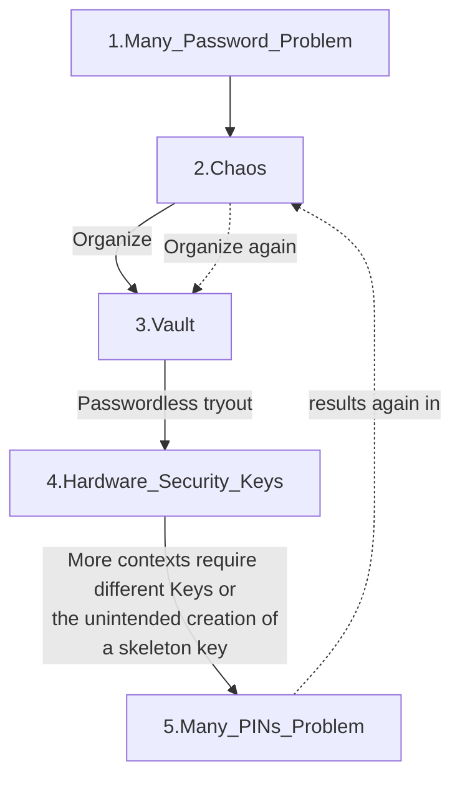
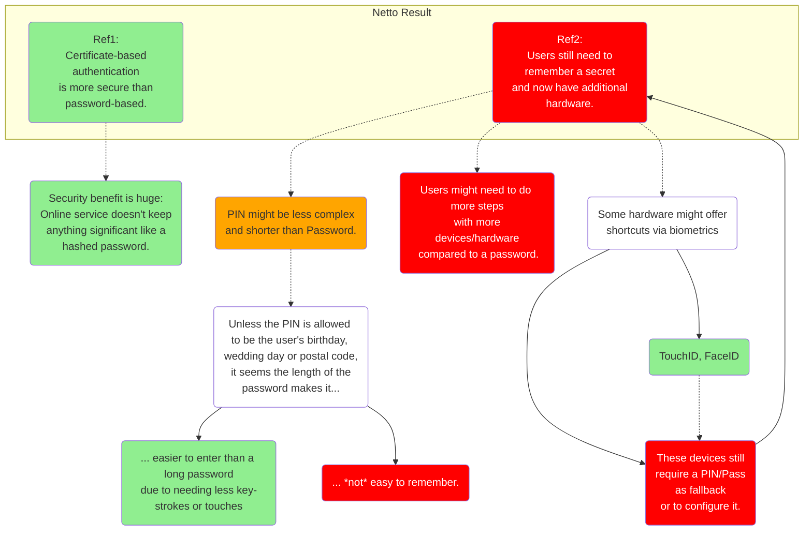

# The Pain Towards Password-less*

Passwords... they have always been a challenge. For the IT professional, as well as your aunt. I've never met anyone who didn't struggle with this. Even experts using the newest technologies can still get themselves in a bind. - This article shows how new technically-impressive solutions still can have suboptimal outcomes for the end-users. 

### Ever experienced issues with passwords?

The following graph demonstrates such a loop and is a simple preview for the rest of the article:

1. Like many users, soon or later you will have too many password to remember.
1. The chaos will have negative side effects.
1. Organisation can be achieved in different ways, among them, by use of a Password Vault.
1. An techy or even Organisation might enforce Passwordless Security Keys for their users.
1. Different contexts could be loaded on the same key, but that is not without risk. Multiple Keys might be used. Either because newer ones can do a new trick, or because a new contexts is clean to setup on a separate key.



### Over the years I have witnessed users struggle with:

- typing their passwords
  - touching the correct keys 
  - using capital letters correct
  - finding that symbol quickly
- remembering their passwords
- saving their passwords in password managers
- selecting their passwords
- realising that for most passwords they should copy and paste their passwords, not type them
- ››remembering how to copy and paste 
- finishing all this before a time-out expires.
- keeping PINs from different apps, phones, devices, things-in-general apart.


### Now, different coop-mechanism :

1. They reuse passwords
2. They write down passwords
   1. In Excel, Word
   2. Post-its
3. Use dates and other information that is not secret.
3. Use of unprotected password managers.
4. Use of password vaults.

## Unpacking the Passwordless Route

In the diagram below you see 4 different paths of Passwordless. 

👉 Takeaway: No current option is truly password-free or rather 'secret-to-remember-free', all of them require some form of secret the user needs to remember. 

```mermaid
graph TD
subgraph Password_Management_Cycle
Base(Using 1 to 3 main passwords)
1(Using Password Variations)
2(Using Excel/Word/Note<br> to keep track of passwords)
3(Using local Password Vault) %%-.- d(Requires remembering masterpassword):::Consequences
4(Using cloudbased Password Vault)
5a(Using passwordless* option:<br> FIDO Security Key)
5b(Using passwordless* option:<br> Authenticator App)
5c(Using passwordless* option:<br> SQRL Client)
5d(Using Single Sign On<br> with OS-account)
%% -
%% Author ref, sorry, not at bottom to get thinner graph.
style Author fill:#f2f2f2
Author>Author:<br> Joeri-Juramento]
%% -
5a-detail(User needs to remember a PIN<br> or set biometric on Key<br> with fall-back PIN.)
5b-detail(User will need THE password<br> or a 'Temporary Access Pass'<br> to set this up.)
5c-detail(User needs to remember<br> a master password,<br> biometric isn't permanent<br> replacement of password.)
5d-detail(User uses Windows Password<br> augmented by Windows Hello)
5d-detail2(User needs to remember<br> Windows Hello PIN<br> or password)
%% -
Base --> 1 --> 2 --> 3 --> 4 --> 5a & 5b & 5d & 5c
5a -.- 5a-detail
5b -.- 5b-detail
5c -.- 5c-detail
5d -.- 5d-detail
5d-detail -.- 5d-detail2
end
%% -
class 2,3,5d OptionalSteps;
class 5a-detail,5b-detail,5c-detail,5d-detail,5d-detail2 Consequences;
%% -
classDef OptionalSteps 2 stroke:#333,stroke-width:2px,stroke-dasharray: 5 5;
classDef Consequences fill:#fff;
classDef Green fill:lightgreen;
classDef Red fill:#FF0000,color:#ffffff
%% -
%%Colours
style 4 fill:#66CCCC
style Base fill:#00FFFF
style 1 fill:#CCFFFF
```

### Adding time and reality 

Let's go down the rabbit hole and find more consequences for the user. In the graph below you see two 'reality boxes' added. 

🔑 At the moment you can add a Security Key to more than one tenants🏢 or more than one account within the same tenant. Logging into website with FIDO2 Security Key Login works perfect and if you have multiple accounts on the key it will let you choose.

... except when you use it to login into your computer. 🙈 If you have your regular account and your separated admin account on the YubiKey, it might login your admin account. On the Windows login screen, you cannot 'choose' which account the Security Key logs in. You can choose the account when you type in a password or PIN, but the security chooses for you. If you have more than one configured within the same tenant: it's a gamble.

🔑🔑 Then another thing, when you have only one Yubikey, it means that your logins are behind the same Security Key PIN. One PIN to protect all of them! So if you add your work, private and admin account, the Security Key itself will protect these secrets behind one single PIN. 😅 

👉 If you don't like the idea that the key of your home also unlocks your office or vice versa, we arrive at the node '...accommodating more contexts or needs' as is written in the Reality box of Security Keys below. If you want to be Gandalf-wise and not have "*One Ring to Rule them All*" or rather "*One Key&PIN to Rule them all*", then perhaps you need more than one Security Key and thus more than one PIN.🐇🕳

```mermaid
graph TD
subgraph Password_Management_Cycle
Base(Using 1 to 3 main passwords)
1(Using Password Variations)
2(Using Excel/Word/Note<br> to keep track of passwords)
3(Using local Password Vault) %%-.- d(Requires remembering masterpassword):::Consequences
4(Using cloudbased Password Vault)
5a(Using passwordless* option:<br> FIDO Security Key)
5b(Using passwordless* option:<br> Authenticator App)
%%5c(Using passwordless* option:<br> SQRL Client)
5d(Using Single Sign On<br> with OS-account)
%% -
5a-detail(User needs to remember a PIN<br> or set biometric on Key<br> with fall-back PIN.)
5b-detail(User will need THE password<br> or a 'Temporary Access Pass'<br> to set this up.)
%%5c-detail(User needs to remember<br> a master password<br> or set biometric.)
5d-detail(User uses Windows Password<br> augmented by Windows Hello)
5d-detail2(User needs to remember<br> Windows Hello PIN<br> or password)
%% -
Base --> 1 --> 2 --> 3 --> 4 --> 5a & 5b & 5d %% & 5c
5a -.- 5a-detail
5b -.- 5b-detail
%%5c -.- 5c-detail
5d -.- 5d-detail
5d-detail -.- 5d-detail2
%% -
class 2,3,5d OptionalSteps;
class 5a-detail,5b-detail,5c-detail,5d-detail,5d-detail2 Consequences;
%% -
  subgraph Reality_Key
  ext5a(Using multiple Security Keys<br>accomodating needs/contexts.) -.-
  ext5a_detail(Different Keys require user<br> to remember different PINs):::Consequences
  %%ext5a --> BasePIN
  end
%% -
	subgraph Reality_App
	ext5ba(Using multiple accounts inside<br> 1 Authenticator App) -->
  ext5bb(Using multiple phones due to<br> limits of Authenticator App) -.-
  ext5bb_detail(Each Authenticator app requires user<br> to remember device PIN or set biometric.):::Consequences
	end
%% -
	style Author fill:#f2f2f2
	Author>Author:<br> Joeri-Juramento]
end
%% Exiting arrows.
5a --> ext5a
5b --> ext5ba
%% Styling with classes https://mermaid-js.github.io/mermaid/#/flowchart?id=styling-and-classes
%%style id2 fill:#bbf,stroke:#f66,stroke-width:2px,color:#fff,stroke-dasharray: 5 5
classDef OptionalSteps 2 stroke:#333,stroke-width:2px,stroke-dasharray: 5 5;
classDef Consequences fill:#fff;
classDef Green fill:lightgreen;
classDef Red fill:#FF0000,color:#ffffff
%%classDef Guider fill:#fff;
%%style Thought fill:#ffCC00
style 4 fill:#66CCCC
%%style 4PIN fill:#66CCCC
%%style Base fill:#00FFFF
%%style BasePIN fill:#00FFFF
style 1 fill:#CCFFFF
%%style 1PIN fill:#CCFFFF
```

Now you might say: *"I have only one personal account and one work account, why should I need two keys?"* Actually, you don't need the second per se, unless you choose wanting to have a backup. If that is the limit of the complexity you're in luck. As long as you remain in that spot, you don't need to worry.

These factors will increase your need for extra Security Keys:

- Wanting a back-up key.
- Starting an extra job with its own login.
- Having admin access for different clients.
- Having admin access for you job but at a separate admin account.
- Starting your own business or side-project.
- Maintaining your own digital environment thus having a separate admin account for security reasons.
- New features for newer keys.
- Because you lost one or misplaced one.
- Feeling discomfort when you type in your Security Key PIN while a co-worker is standing next to you. 

Now besides keys, sometimes you can turn your phone into a key, with the Authenticator app from Microsoft you can register your device with an organisation-tenant and enable passwordless sign-in with your phone. I added the Reality box to this feature as well. It works...

... except if you want to register more than one account in the app. You can add the device as a second factor for multiple accounts, but to use that app to replace the password, that is limited to one account per phone only. 

👉 That means you need to have multiple phones if you want to use this feature for more than one account.🐇🕳

### A logical consequence

Now if we look at the update graph again, we can see a common nominator... 

We don't have passwords anymore, but now we have PINs! <sarcarsm> Jay! </sarcasm>

```mermaid
graph TD
subgraph Password_Management_Cycle
Base(Using 1 to 3 main passwords)
1(Using Password Variations)
2(Using Excel/Word/Note<br> to keep track of passwords)
3(Using local Password Vault) %%-.- d(Requires remembering masterpassword):::Consequences
4(Using cloudbased Password Vault)
5a(Using passwordless* option:<br> FIDO Security Key)
5b(Using passwordless* option:<br> Authenticator App)
%%5c(Using passwordless* option:<br> SQRL Client)
5d(Using Single Sign On<br> with OS-account)
%%
5a-detail(User needs to remember a PIN<br> or set biometric on Key<br> with fall-back PIN.)
5b-detail(User will need THE password<br> or a 'Temporary Access Pass'<br> to set this up.)
%%5c-detail(User needs to remember<br> a master password<br> or set biometric.)
5d-detail(User uses Windows Password<br> augmented by Windows Hello)
5d-detail2(User needs to remember<br> Windows Hello PIN<br> or password)
%%
Base --> 1 --> 2 --> 3 --> 4 --> 5a & 5b & 5d %% & 5c
5a -.- 5a-detail
5b -.- 5b-detail
%%5c -.- 5c-detail
5d -.- 5d-detail
5d-detail -.- 5d-detail2
%%
class 2,3,5d OptionalSteps;
class 5a-detail,5b-detail,5c-detail,5d-detail,5d-detail2 Consequences;
%%
  subgraph Reality_Key
  ext5a(Using multiple Security Keys<br>accomodating needs/contexts.) -.-
  ext5a_detail(Different Keys require user<br> to remember different PINs):::Consequences
  %%ext5a --> BasePIN
  end
%%
	subgraph Reality_App
	ext5ba(Using multiple accounts inside<br> 1 Authenticator App) -->
  ext5bb(Using multiple phones due to<br> limits of Authenticator App) -.-
  ext5bb_detail(Each Authenticator app requires user<br> to remember device PIN or set biometric.):::Consequences
	end
end
%%
%% Exiting arrows.
5a --> ext5a
5b --> ext5ba
%%
subgraph PIN_Management_Cycle
BasePIN(Using 1 to 3 main PINs)
1PIN(Using PIN variations)
4PIN(Using cloudbased Vault<br>to keep track of PINs)
Thought("Are you freaking<br> kidding me?!!")
BasePIN --> 1PIN --> 4PIN -.- Thought
	%%Author ref here to keep result thinner.
  style Author fill:#f2f2f2
  Author>Author:<br> Joeri-Juramento]
end
ext5a_detail & ext5bb_detail & 5d-detail2 --> BasePIN
%%
%% subgraph Overlap
%% Repeat([The user experiences<br> are similar to]):::Consequences -.-
%% Repeat_detail(Problem has been moved,<br> not solved.):::Consequences -.->
%% Repeat_detail2(User still needs to<br> remember  a secret):::Consequences -.->
%% Repeat_detail3(Secret should be complex<br> for the benefit of security):::Consequences -.->
%% Repeat_detail4(Complexity is inherenlty<br> harder to remember.):::Consequences
%% Repeat_detail4 --> Ref1 & Ref2 
%%   subgraph Netto_Result[Netto Result - see below]
%%   Ref1:::Red 
%%   Ref2:::Green
%%   end
%% end
%%
%% 4PIN ==> Repeat ==> 4
%%
%%Password_Management_Cycle --> Netto_Result
%%
%% Styling with classes https://mermaid-js.github.io/mermaid/#/flowchart?id=styling-and-classes
%%style id2 fill:#bbf,stroke:#f66,stroke-width:2px,color:#fff,stroke-dasharray: 5 5
classDef OptionalSteps 2 stroke:#333,stroke-width:2px,stroke-dasharray: 5 5;
classDef Consequences fill:#fff;
classDef Green fill:lightgreen;
classDef Red fill:#FF0000,color:#ffffff
style Thought fill:#ffCC00
style 4 fill:#66CCCC
style 4PIN fill:#66CCCC
style Base fill:#00FFFF
style BasePIN fill:#00FFFF
style 1 fill:#CCFFFF
style 1PIN fill:#CCFFFF
````

After the Passwords grew in numbers, we had to put them into the Vault to deal with them...

We got passwordless Security Keys and now, because one Security Key might be more of a risk than a blessing, resulting in needing different PINs...

👉 Now I need the vault again to keep track of the different PINs. 


Now I am aware that my use case might be exceptionally more complicated than most, but the underlying critique is not depended on how many keys you have. Reality will force you to remember different PINs even if you have only one key. 

Just by adding time the need for remembering PINs will increase when you start replacing passwords for one or more Security Keys or auth devices. It's because keys got PINs, phones got PINs, tablets got PINs, apps on those mobile devices might have PINs, even once laptops might have PINs. Another example, your bank or credit card has a PIN and your Bank's app might have a PIN. 

And besides the fact it is unwise to use one PIN for all, you most likely can't:

One PIN requires four digits, the other needs 6 digits and another doesn't allow you to type in your birth year. Which brings us to:

### A painful realisation:

We add the 'Overlap' box on the right side. Please read the nodes and the arrows in bold.

```mermaid
graph TD
%%
subgraph Password_Management_Cycle
Base(Using 1 to 3 main passwords)
1(Using Password Variations)
2(Using Excel/Word/Note<br> to keep track of passwords)
3(Using local Password Vault) %%-.- d(Requires remembering masterpassword):::Consequences
4(Using cloudbased Password Vault)
5a(Using passwordless* option:<br> FIDO Security Key)
5b(Using passwordless* option:<br> Authenticator App)
%%5c(Using passwordless* option:<br> SQRL Client)
5d(Using Single Sign On<br> with OS-account)
%%
5a-detail(User needs to remember a PIN<br> or set biometric on Key<br> with fall-back PIN.)
5b-detail(User will need THE password<br> or a 'Temporary Access Pass'<br> to set this up.)
%%5c-detail(User needs to remember<br> a master password<br> or set biometric.)
5d-detail(User uses Windows Password<br> augmented by Windows Hello)
5d-detail2(User needs to remember<br> Windows Hello PIN<br> or password)
%%
Base --> 1 --> 2 --> 3 --> 4 --> 5a & 5b & 5d %% & 5c
5a -.- 5a-detail
5b -.- 5b-detail
%%5c -.- 5c-detail
5d -.- 5d-detail
5d-detail -.- 5d-detail2
%%
class 2,3,5d OptionalSteps;
class 5a-detail,5b-detail,5c-detail,5d-detail,5d-detail2 Consequences;
%%
  subgraph Reality_Key
  ext5a(Using multiple Security Keys<br>accomodating needs/contexts.) -.-
  ext5a_detail(Different Keys require user<br> to remember different PINs):::Consequences
  %%ext5a --> BasePIN
  end
%%
	subgraph Reality_App
	ext5ba(Using multiple accounts inside<br> 1 Authenticator App) -->
  ext5bb(Using multiple phones due to<br> limits of Authenticator App) -.-
  ext5bb_detail(Each Authenticator app requires user<br> to remember device PIN or set biometric.):::Consequences
	end
end
%% Exiting arrows.
5a --> ext5a
5b --> ext5ba
%%
subgraph PIN_Management_Cycle
BasePIN(Using 1 to 3 main PINs)
1PIN(Using PIN variations)
4PIN(Using cloudbased Vault<br>to keep track of PINs)
Thought("Are you freaking<br> kidding me?!!")
BasePIN --> 1PIN --> 4PIN -.- Thought
end
ext5a_detail & ext5bb_detail & 5d-detail2 --> BasePIN
%%
subgraph Overlap
Repeat([The user experiences<br> are similar to]):::Consequences -.-
Repeat_detail(Problem has been moved,<br> not solved.):::Consequences -.->
Repeat_detail2(User still needs to<br> remember  a secret):::Consequences -.->
Repeat_detail3(Secret should be complex<br> for the benefit of security):::Consequences -.->
Repeat_detail4(Complexity is inherenlty<br> harder to remember.):::Consequences
Repeat_detail4 --> Ref1 & Ref2 
	subgraph Netto_Result[Netto Result - see below]
	Ref1:::Red 
	Ref2:::Green
	end
end
%%
4PIN ==> Repeat ==> 4
%%
%%Password_Management_Cycle --> Netto_Result
%%
%% Styling with classes https://mermaid-js.github.io/mermaid/#/flowchart?id=styling-and-classes
%% Example style id2 fill:#bbf,stroke:#f66,stroke-width:2px,color:#fff,stroke-dasharray: 5 5
classDef OptionalSteps 2 stroke:#333,stroke-width:2px,stroke-dasharray: 5 5;
classDef Consequences fill:#fff;
classDef Green fill:lightgreen;
classDef Red fill:#FF0000,color:#ffffff
%%
style Thought fill:#ffCC00
style 4 fill:#66CCCC
style 4PIN fill:#66CCCC
style Base fill:#00FFFF
style BasePIN fill:#00FFFF
style 1 fill:#CCFFFF
style 1PIN fill:#CCFFFF
style Author fill:#f2f2f2
Author>Author:<br> Joeri-Juramento]
```

We have come full circle. At least seemingly, I, the user, was in a situation in which I need to remember different secrets so I kept them safe in a Vault so I wouldn't forget them. 

Now, Security Keys or Authentictor-Apps-with-Passwordless-sigin emerged, and I thought: no more passwords. 

**They were exchanged for PINs**. 

So now I'm in a situation in which I need to remember secrets of a shorter length, but still need to keep them safe. So in the Vault they go. Déjà vu?!

Some devices have biometric options. Great! Unless something goes wrong and the fall-back requires the PIN/pass again and in *that* situation I've used the PIN less often and therefore is harder for me to recall. So I need to peek in the Vault again, which requires a Password to open. #fun.

Let's recap on the progress that has been made.

### Finding The Netto Benefit

We zoom in at the red & green boxes above name 'Ref1' and 'Ref2'. Let's unpack.



Okay, so from a technical standpoint, the progress is impressive. I've spared you, but the technology under the hood is impressive. If you want your head to hurt, look into FIDO2, CTAP2, U2F and Attestation, also a fun activity. Explain that to a regular user. Also explain why some browser will not offer the Security Key log-in method and why others do. #sigh 

The fact that FIDO2 key linked to your account is based on asymmetric key cryptography resulting in a public key not-a-secret that can be openly shared with an online service, is something that I can excited about as a techy🤓😎, but if I put my emulate-a-regular-user-glasses on, I don't really care that hashed passwords can leak and the Security Key's public key isn't a secret. So I'm better protected against phishing or data leaks? Snore. Now here is where my 'emulator' starts to stutter. I observe that this point of better protection/authentication, doesn't seem to motivate most people. The technology's default will decide for them what they will use. If by account creation you ask them "Which one would you like?", this argument does not motivate people to use the Security Key. (I suspect.)

👉 Anyway, from a usability perspective, the benefit or progress is not so much: I still need to remember stuff I don't really want to remember, but the system is making me remember it (or save it) because FIDO2 requires a PIN one way or another. 🔢🔡🔒

A interesting take away from my observations:

Users struggle with typing in long complicated passwords, however PINs are not always easier. It might have a higher chance of success, but regardless, they both get forgotten or confused amongst each other and mistakes happen.

🎯 A workable, scalable alternative to passwords also needs to make progress in the user/interaction realm. Great that it increases security; but it better also increase usability. It also shouldn't be harder to use over time.


## Circling back to the price (effort)

Now Microsoft has launched passwordless login a while ago.

Here are some counter-intuitive experiences.

- To activate passwordless inside the Authenticator App, you need... a password. (Or a temporary Pass(word)). I am not the first human being seeing the irony of that. At the moment of writing the implementation of Authenticator App by Microsoft is a fancy wrapper around a password which can replace it, but in order to "get there", you need the password.

Please all count to 10 and exhale...😤

- So the whole onboarding procedure to Passwordless*, requires passwords.

- And if you change your password, you will break the Authenticator App's ability to help you sign-in without a password. You'll need to activate it again.

- The Security Key's login capability will not break if you change your password. 

The Security Key route, which has different form factors like a Kensington fingerprint-scanner or a YubiKey, is a semi-replacement of the password, but, in order to onboard or activate it, you need a password. In theory I could send a prepped YubiKey to the user but that would I also need to set the PIN and how do I securely share this PIN with the user? 

The experience for the user with a Kensington fingerprint-scanner seems wonderful. Until they need the fall-back PIN, but the number of extreme happy flows seems wonderful before that happens can be impressive. However, when the system gets into a locked state somehow, requiring that fall-back PIN, we can only hope users can access the vault where the PIN is stored via their phone and not on their laptop or desktop.


## Wrap up

So these Security Keys with their PINs are not the holy grail in their current implementation form. Amongst other issues, the main problem is just being moved from passwords to PINs. The authentication hardship has moved - read slowly - from a hardship between the user and a website to the user and the Security Key.

The benefits melt away simply by adding reality.

Two topics exist I would like to discuss next time. The Authenticator app and comparing same-device auth versus multi-device auth and my observations with end-users. Next I might roll into expressing some design scenario's on what would be a better fit as an alternative to passwords. The current options seem technology-driven and we should probably take our hats off to its authors, but I want more! I want us to find that bliss point between technology, security and human user-friendly interaction.

Until next time.

---

•••

Joeri • Juramento


All Rights Reserved - You may refer.


